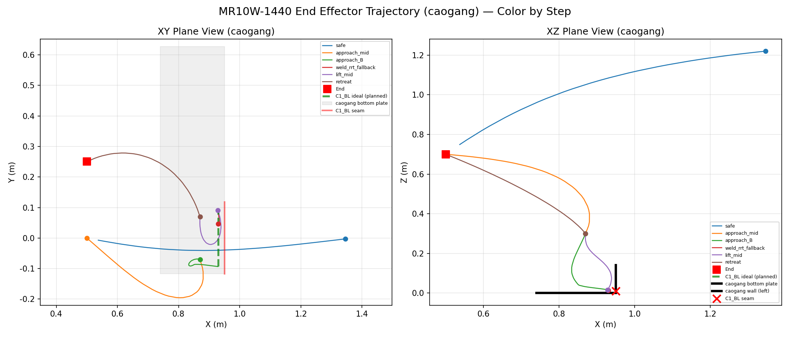
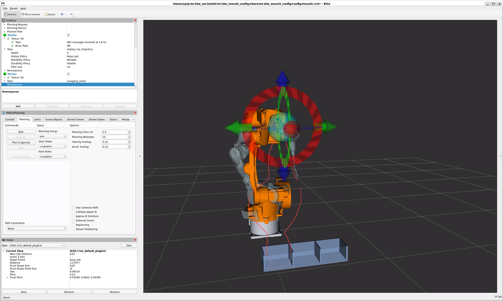
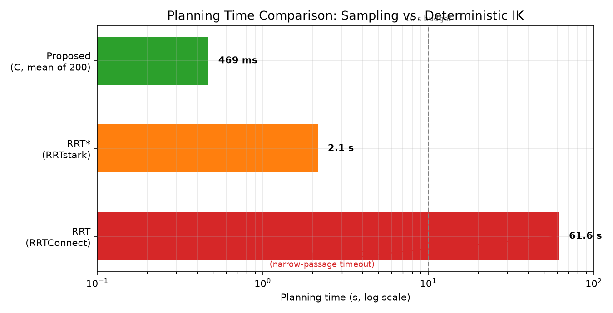
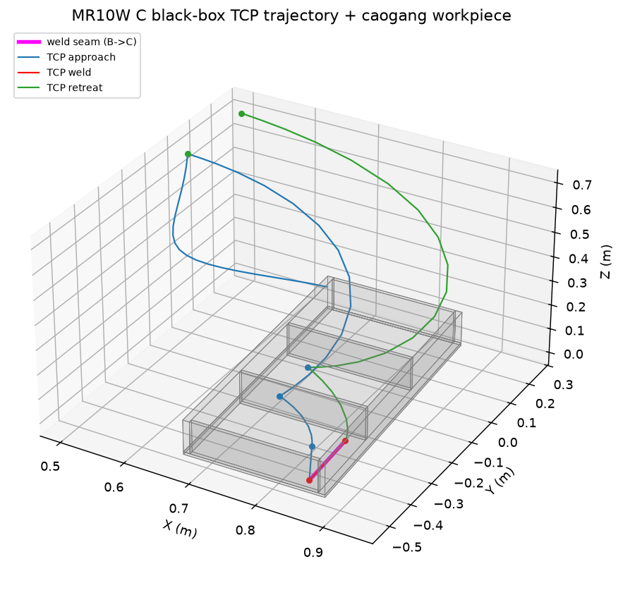
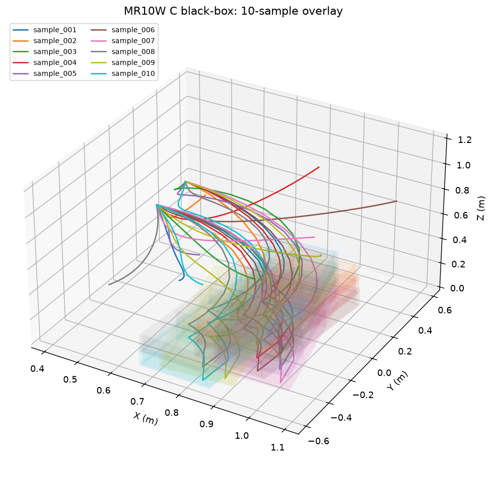
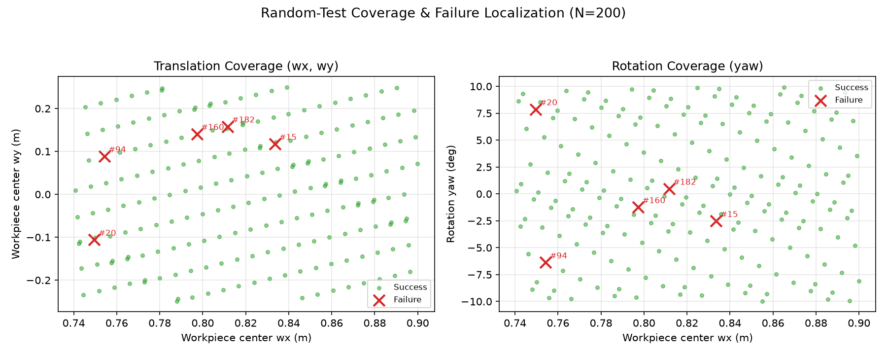
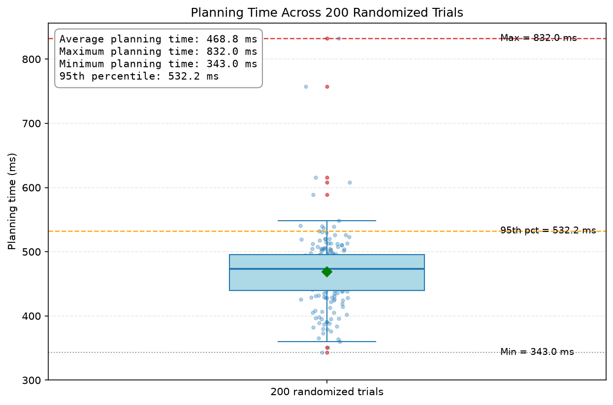
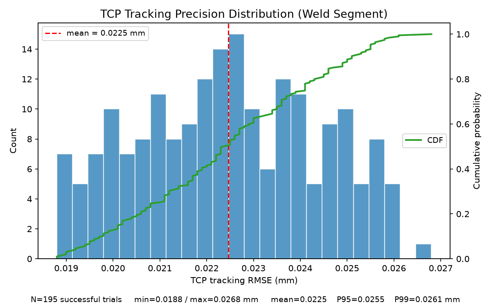
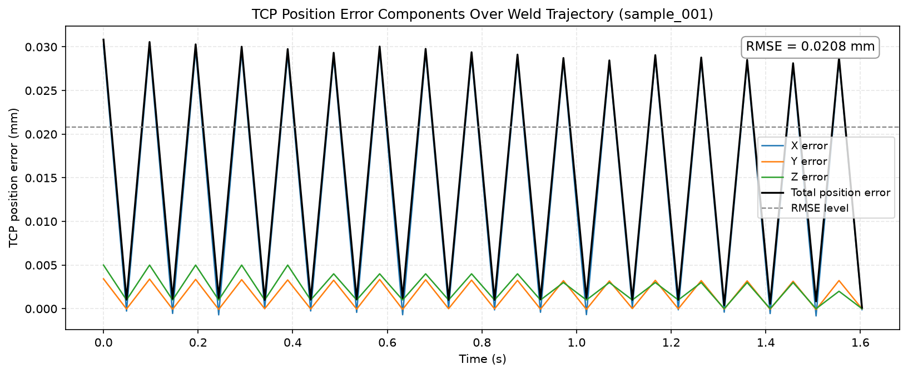

> English | [中文](README_CN.md)

# col_de

A **ROS2 + MoveIt2** obstacle-avoidance joint-space trajectory planning framework for robotic manipulators.

> This repository contains obstacle-avoidance planning code for ROS2 + MoveIt2, demonstrating 6-DOF manipulator obstacle avoidance and RViz visualization.

Core idea: instead of sampling-based planners, it relies on **"IK inverse kinematics + waypoint collision checking + trapezoidal velocity profiling"** to deterministically generate continuous trajectories that satisfy joint limits, collision, velocity, and acceleration constraints from a sequence of Cartesian target poses (or a straight/curved path).

## Core Capabilities

| Module | File | Description |
|---|---|---|
| Configuration | `src/config.py` | Joint names, group, tcp/base frames, limits, velocity/acceleration — fully configurable |
| IK solving | `src/ik_solver.py` | Multi-seed enumeration (elbow/wrist flips) + joint-limit filtering + minimum-joint-change selection |
| Collision checking | `src/collision_checker.py` | Based on `/check_state_validity` (FCL); single-state and dense along-path validation |
| Velocity profiling | `src/trapezoid.py` | Pure functions, no ROS dependency; triangular/trapezoidal profiles + verification |
| Planner node | `src/planner_node.py` | Orchestrates IK/collision/velocity planning, execution, TF recording, and metrics |

## Dependencies

- ROS2 (Humble or newer)
- MoveIt2 (providing `/compute_ik` and `/check_state_validity` services)
- A robot controller (providing the `FollowJointTrajectory` action)
- Python: `scipy`, `matplotlib`, `PyYAML`

## Quick Start

1. Start your MoveIt and robot controller (IK, collision-checking services, and the trajectory-control action must be available).
2. Edit [`config/params.yaml`](config/params.yaml) to match your robot's joint names, group, tcp/base frames, and joint limits.
3. Run the example:

```bash
colcon build
source install/setup.bash
ros2 run col_de demo_waypoints --config <path/to/params.yaml>
# or use launch (auto-locates the installed params.yaml)
ros2 launch col_de demo.launch.py
```

The example [`src/demo/demo_waypoints.py`](src/demo/demo_waypoints.py) demonstrates the full workflow of "placing a box obstacle + following a straight-line path". All coordinates are placeholders; adapt them to your workspace.

## Usage (as a library)

```python
from src.planner_node import PlannerNode, make_pose

node = PlannerNode(config_path="config/params.yaml")
node.wait_for_services()

pose = make_pose(0.5, 0.0, 0.3, euler_rad=[3.1416, 0.7854, 0.0],
                 frame_id=node.cfg.base_frame)
joints = node.solve_ik(pose, label="target")      # IK solve
if joints is not None:
    timed = node.timed_from_joints(joints)        # trapezoidal velocity profiling
    ok, _ = node.execute(timed, label="target")   # execute
```

For a straight-line path, refer to `_plan_line` / `_move_line`: sample along the line, solve IK point by point, and feed each solution as the seed for the next (seed locking) to maintain a consistent arm configuration.

## Results

### RRT planned trajectory



### Planned trajectory

Obstacle-avoidance planning demo of a 6-DOF manipulator in ROS2.




In this 6-DOF narrow-cavity welding scenario, RRT suffers from narrow-passage issues and randomness, causing timeouts, circuitous paths, and failure to complete the straight-line weld. In contrast, deterministic numerical IK combined with collision checking and process-constraint guidance solves the straight weld stably in milliseconds, with shorter paths that closely track the seam — outperforming RRT across the board.

## C Library Test Results

> Note: the following figures and metrics were produced by the same algorithm packaged as a pure C99 library, rather than by direct execution of the ROS Python code.

Success rate ≈ 98% (200 random tests), weld-segment RMSE ≈ 0.02 mm, millisecond-level planning per run, and repeat-run joint-angle deviation < 1e-9 rad.

### 3D trajectory (single run)

Single-run 3D trajectory of the torch TCP.


### Overlaid trajectories (multiple runs)

Overlaid planning results across multiple random poses, comparing trajectories under different workpiece placements.


### Coverage and failure samples

Workspace coverage over 200 random tests. The 5 failure samples are confined to extreme boundary workpiece poses; all normal-condition cases pass.


### Planning time distribution

Boxplot of per-solve time across 200 random tests.


### Tracking error distribution



RMSE distribution of the TCP tracking error relative to the ideal weld seam along the welding segment. All successful samples fall within 0.019–0.027 mm (mean ≈ 0.023 mm), with very narrow P95/P99, indicating stable tracking precision with no outlier drift.

### TCP position error

TCP position error components over the welding trajectory time (sample_001).


## Directory Structure

```
col_de/
├── src/
│   ├── config.py
│   ├── trapezoid.py
│   ├── ik_solver.py
│   ├── collision_checker.py
│   ├── planner_node.py
│   └── demo/
│       ├── simple_scene.py
│       └── demo_waypoints.py
├── docs/images/
├── config/params.yaml
├── launch/demo.launch.py
└── LICENSE
```

## License

[MIT](LICENSE)